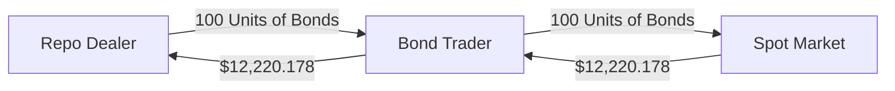
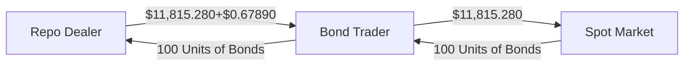

# 
 **Fixed Income**
# 
 **Assingment 2**

### 
 Hao CHEN, Betty WANG,  Iris ZHANG, Shirley ZHANG

---

# Part 1 Trading at the level of Interest Rate
## Question 1 Bond Value

<!--  -->
- By dicounting every cash flow at the corresponding zero rates, the value of the 4-year T-bond is **\$122.20178** with 10% coupon rate, $100 face value and semi-annual compounding frequency.

## Question 2 Modified Duration and Convexity

### 2.1 Modified duration
- We use three methods to compute the mod´ified duration.
- Method 3 uses the approximation formula from class and gives a **ModD = 3.38407**, assuming a one percentage upward and downward shifts.
<!-- e.g. $$ \frac{a-1}{b-1} \quad and \quad {a+1\over b+1} $$ -->
$$ ModDuration \approx \frac{\% \Delta BondValue}{\Delta Yield} $$

- The other two methods leverage the relationship between Macauley Duration and Modified Duration.
  - Method 1 dicounts the every DCF-weighted time periods with the corresponding zero rates.
  - Method 2 first calculates the YTM of this bond and then back out the Modified Duration using the following formula:
$$ ModDuration = \frac{MacDuration}{1+\frac{YTM}{m}} $$

### 2.2 Convexity

- For convexity, we simply apply the standard formula, which gives a **convexity = 14.1399**:
$$ Convexity = \frac {1}{B*(1+\frac ym)} \sum_{i=1}^{n}[{\frac {CF_i}{({1+\frac ym})^{m{t_i}}}(t_i + \frac{t_i}{m})]}$$

## Question 3  Reverse Repo
### 
 Initial Transcations

### 
 Tomorrow's Transcations

- During the initial transcations, I (the bond trader) borrow 100 units of T-bonds from the broker, and then sell them all in the spot market.
 

- If the yield curve shifts upward by one percentage point, the bond price would decrease by 3.31% to **$118.15280**
- The net payoff is **\$404.21895**, calculateed with short-selling proceeds net of total bond values tomorrow and Interests payments. The formula for interests payments is:
$$ Interests = \frac {1 Day}{360 Days}*Sepcial Repo Rate$$

---

# Part 2 Steepener Trade

## Question 1
- For zero-coupon bonds, the maturity is equal to Macauley Duration.
- Leveraging the rationship between Macauley Duration and Modified Duration, we get taht the modified duration for 1-yr zero-coupon bond is **0.99684** and **4.92713** for 5-yr zero-coupon bond. the YTMs used are on 2010-11-30. The compounding period $m$ is 1.
$$ ModDuration_i = \frac{MacDuration_i}{1+\frac{YTM_i}{m}} $$
- To immunize the portfolio, we would like the value-weighted duration of the portfolio to be zero. i.e.
$$ \sum_{i=1}^{n}{ModDuration_i*Value_i} = 0 $$
- Hence, we should take a short position in \$0.2023 million of 5-yr zero bonds. The market value of the portfolio would then be **\$0.79768 million**.

## Question 2
- First, we can get the face value of two assets and the portfolio on 2010-11-30.
- One month later, the yield curve changed. 1-yr yield went from 0.317% to 0.352%, up 3.5 bp, 5-yr went from 1.479% to 2.04%, up 56.1 bp.
- Next, we could dicount the face value of the two bonds back to present value on 2010-12-31. The maturity is 4year+11months.
- The present value of both bonds dropped. The 1-yr bond dropped to **\$0.99994 million** while the 5-yr bond dropped to **\$0.19715 million**. But since we were longing the 1-yr and shorting the 5-yr, the present value of the portfolio rose by **\$0.00511 million**, or 0.64%.

## Question 3
  - If 1-yr rate had stayed constant and 5-yr had gone down by 50 bp.
  - Going through the same procedures in Question 2, we would find that the present value of 1-yr bond rose to **\$1.00026 million** while the present value of 5-yr bond rose to **\$0.20754 million**. The value of the portfolio as a whole dropped **\$0.00496 million**, or **-0.62%**.

---
# Part 3 Butterfly Strategy

## Question 1
- For zero-coupon bonds, the maturity is equal to Macauley Duration.
- Leveraging the rationship between Macauley Duration and Modified Duration, the modified duration of the three bonds are in the table above.
## Question 2
- First, we discount the face value of $1000 5-yr bonds. The present value of the short position of the 5-yr bonds are **\$783.526**.
- Modified Duration neutral:
$$ 1.905x - 4.762 * \$783.526 + 9.524z = 0 $$
- Cash neutral:
$$ x - \$783.526 + z = 0 $$

## Question 3
- Solving for these two contrains, the face value and present value for the 2-yr bonds and 5-yr bonds are in the above table.

## Question 4

- The value change graph shows that as long as the movement of yield curve is parallel, there are always positive returns.

## Question 5

- In this case,the yield curve becomes upward sloping. The portfolio would suffer a loss of **\$52.933**.
